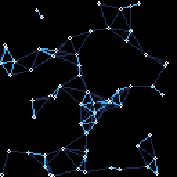

# tweetcart_workshop

## Description
Inspired by the demoscene, we will study and produce retro looking visuals in PICO-8 with the hopes of fitting them in a tweet's length worth of code. We will be coding in Lua, a simple scripting language that can be picked up fairly quickly by someone who is comfortable with coding.

Some background:
- The demoscene is an international computer art subculture focused on producing demos: self-contained, sometimes extremely small, computer programs that produce audiovisual presentations. 
- PICO-8 is a virtual console for making and playing retro looking visuals, games and tools.
- Tweetcarts are PICO-8 cartridges whose code fits inside a single tweet. Basically, you can copy the code, paste it into a blank PICO-8 cart, and see the same effect that's shown in the original tweet. 

Some examples:

- [link](https://twitter.com/fernandojsg/status/1101800243216244737) | [src](tweetcarts/examples/fernandojsg_graph.p8)
  - 
- [link](https://twitter.com/alexthescott/status/1502791044810772481) | [src](tweetcarts/examples/alexthescott_colorful_squigle.p8)
  - 